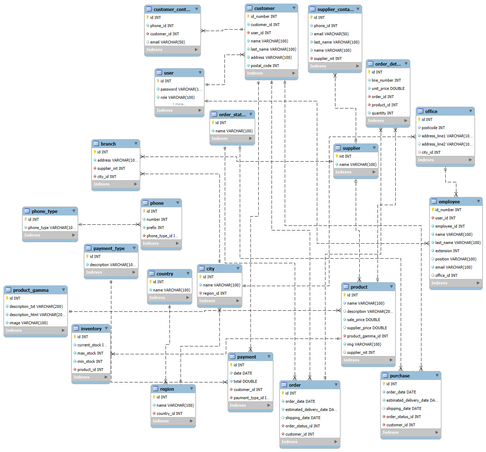

# **Sistema de Gestión Empresarial**

## **Introducción al Proyecto**

Este proyecto es un sistema de gestión empresarial diseñado para automatizar y mejorar la eficiencia de las operaciones administrativas de Grab&Go. Proporciona una solución integral que permite la gestión de productos, clientes, pedidos, pagos, empleados y oficinas desde un único lugar. El sistema está diseñado para ser escalable y fácil de usar, y se compone de un backend robusto y un frontend interactivo.

La implementación del sistema permite a los administradores llevar a cabo diversas operaciones administrativas, facilitando la toma de decisiones informadas a través de consultas y análisis de datos. Este proyecto está enfocado en proporcionar una experiencia de usuario fluida y eficiente, asegurando que todas las interacciones con el sistema sean rápidas, seguras y fiables.

## **Tecnologías Utilizadas**

El proyecto se construye utilizando un conjunto de tecnologías modernas y probadas para garantizar su eficiencia y escalabilidad:

### **Backend**
- **Java** con **Spring Boot**: Para manejar la lógica de negocio.
- **Spring Data JPA**: Para la persistencia de datos y la interacción con la base de datos.
- **PostgreSQL**: Como base de datos relacional para almacenar la información de manera estructurada desde railway.
- **Spring Security**: Para asegurar la autenticación y autorización dentro del sistema.
- **Maven**: Para la gestión de dependencias y el ciclo de vida del proyecto.

### **Herramientas de Desarrollo**
- **Visual Studio Code**: Como entorno de desarrollo principal para editar y gestionar el código fuente.
- **GitHub**: Para el control de versiones y la colaboración en el desarrollo del proyecto.

## **Casos de Uso**

El sistema cubre una variedad de casos de uso que permiten a los administradores del sistema realizar múltiples operaciones administrativas. A continuación, se presenta una lista de los casos de uso incluidos en el proyecto:

1. **Gestionar Productos**: Añadir, editar, eliminar y consultar productos.
2. **Gestionar Clientes**: Administrar la información de los clientes.
3. **Gestionar Pedidos**: Procesar y gestionar pedidos realizados por los clientes.
4. **Gestionar Pagos**: Manejar los registros de pagos y su verificación.
5. **Gestionar Empleados**: Administrar los datos de los empleados.
6. **Gestionar Oficinas**: Gestionar la información y ubicación de las oficinas.
7. **Consultar Productos por Gama**: Buscar productos que pertenecen a una categoría específica.
8. **Consultar Pagos por Cliente**: Verificar los pagos realizados por un cliente determinado.
9. **Consultar Empleados por Oficina**: Obtener una lista de empleados asociados a una oficina específica.
10. **Consultar Productos con Bajo Stock**: Identificar productos cuyo stock está por debajo de un umbral definido.
11. **Consultar Pedidos en un Rango de Fechas**: Buscar pedidos dentro de un intervalo de fechas determinado.
12. **Consultar Pagos por Método de Pago**: Analizar pagos realizados con un método de pago específico.
13. **Consultar Clientes con Pedidos Pendientes**: Obtener clientes que tienen pedidos pendientes de procesamiento.
14. **Consultar Empleados y sus Pedidos Asignados**: Revisar los pedidos asignados a cada empleado.
15. **Validar Datos de Productos**: Asegurar que los datos de productos ingresados sean válidos.
16. **Validar Datos de Clientes**: Verificar la validez de la información proporcionada por los clientes.
17. **Validar Datos de Pedidos**: Confirmar la exactitud de los datos de los pedidos.
18. **Validar Datos de Pagos**: Validar la información de los pagos realizados.
19. **Validar Datos de Empleados**: Verificar que los datos de los empleados sean correctos.
20. **Visualizar Lista de Productos**: Presentar una lista completa de productos disponibles en el sistema.
21. **Agregar Nuevo Producto**: Introducir un nuevo producto en el sistema.
22. **Editar Producto Existente**: Modificar los detalles de un producto ya registrado.
23. **Eliminar Producto**: Quitar un producto existente del sistema.
24. **Visualizar Detalles del Cliente**: Mostrar la información detallada de un cliente específico.
25. **Visualizar Lista de Pedidos**: Mostrar una lista completa de pedidos registrados en el sistema.

---

### **MODELO RELACIONAL**

<!--  -->

**DDL**

```postgresql
create table country(
    id int auto_increment primary key,
    name varchar(100) not null
);

create table region(
	id int auto_increment primary key,
	name varchar(100) not null,
    country_id int not null,
    constraint FK_country_id foreign key(country_id) references country(id)
);

create table city(
	id int auto_increment primary key,
	name varchar(100) not null,
	region_id int  not null,
	constraint FK_region_id foreign key(region_id) references region(id)
);

create table office(
	id int auto_increment primary key,
	postcode int(6) not null,
	address_line1 varchar(100) not null,
	address_line2 varchar(100),
	city_id int,
	constraint FK_city_id_office foreign key(city_id) references city(id)
);

create table user(
    id int auto_increment primary key,
    password varchar(100) not null,
    role varchar(100) not null,
    username varchar(100) not null
);

create table supplier(
    nit int(9) primary key,
    name varchar(100) not null
);

create table product_gamma(
    id int auto_increment primary key,
    description_txt varchar(200) not null,
    description_html varchar(200) not null,
    image varchar(100) not null
);

create table phone_type(
    id int auto_increment primary key,
    phone_type varchar(100) not null
);

create table order_status(
    id int auto_increment primary key,
    name varchar(100) not null
);

create table payment_type(
	id int auto_increment primary key,
    description varchar(100) not null
);

create table customer(
    id_number int(10) primary key,
    customer_id int not null,
    user_id int not null,
    name varchar(100) not null,
    last_name varchar(100) not null,
    address varchar(100) not null,
    postal_code int(6) not null,
    constraint FK_user_id_customer foreign key(user_id) references user(id)
);

create table employee(
    id_number int not null primary key,
    user_id int not null,
    employee_id int not null,
    name varchar(100) not null,
    last_name varchar(100) not null,
    extension int(5) not null,
    position varchar(100),
    email varchar(100) not null,
    office_id int,
    constraint FK_user_id_employee foreign key(user_id) references user(id),
    constraint FK_office_id_employee foreign key(office_id) references office(id)
);

create table product(
    id int auto_increment primary key,
    name varchar(100) not null,
    description varchar(200) null,
    sale_price double not null,
    supplier_price double null,
    product_gamma_id int not null,
    img varchar(100) not null,
    supplier_nit int(9) null,
    constraint FK_product_gamma_id_product foreign key(product_gamma_id) references product_gamma(id),
    constraint FK_supplier_nit_product foreign key(supplier_nit) references supplier(nit)
);

create table phone(
    id int auto_increment primary key,
    number int(15) not null,
    prefix int(5) not null,
    phone_type_id int not null,
    constraint FK_phone_type_id_phone foreign key(phone_type_id) references phone_type(id)
);

create table customer_contact(
    id int auto_increment primary key,
    phone_id int not null,
    customer_id int not null,
    email varchar(50) null,
    constraint FK_customer_id_customer_contact foreign key(customer_id) references customer(id_number)
);

create table inventory(
    id int auto_increment primary key,
    current_stock int(6) not null,
    max_stock int(6) not null,
    min_stock int(6) not null,
    product_id int not null,
    constraint FK_product_id_inventory foreign key(product_id) references product(id)
);

CREATE TABLE `order` (
    id INT AUTO_INCREMENT PRIMARY KEY,
    order_date DATE NOT NULL,
    estimated_delivery_date DATE NOT NULL,
    shipping_date DATE NULL,
    order_status_id INT NOT NULL,
    customer_id INT NOT NULL,
    CONSTRAINT FK_order_status_id_order FOREIGN KEY (order_status_id) REFERENCES order_status(id),
    CONSTRAINT FK_customer_id_order FOREIGN KEY (customer_id) REFERENCES customer(id_number)
);

create table order_detail(
    id int auto_increment primary key,
    line_number int(6) not null,
    unit_price double not null,
    order_id int not null,
    product_id int not null,
    quantity int(6) not null,
    constraint FK_order_id_order_detail foreign key(order_id) references `order`(id),
    constraint FK_product_id_order_detail foreign key(product_id) references product(id)
);

create table purchase(
    id int auto_increment primary key,
    order_date date not null,
    estimated_delivery_date date not null,
    shipping_date date null,
    order_status_id int not null,
    customer_id int not null,
    constraint FK_order_status_id_purchase foreign key(order_status_id) references order_status(id),
    constraint FK_customer_id_purchase foreign key(customer_id) references customer(id_number)
);

create table supplier_contact(
    id int auto_increment primary key,
    phone_id int not null,
    email varchar(50) null,
    last_name varchar(100) not null,
    name varchar(100) not null,
    supplier_nit int(9) not null,
    constraint FK_supplier_nit_supplier_contact foreign key(supplier_nit) references supplier(nit)
);

create table branch(
	id int auto_increment primary key,
    address varchar(100) not null,
    supplier_nit int not null,
    city_id int not null,
    constraint FK_supplier_nit_branch foreign key(supplier_nit) references supplier(nit),
    constraint FK_city_id_branch foreign key(city_id) references city(id)
);

create table payment(
	id int auto_increment primary key,
    date date not null,
    total double not null,
    customer_id int(10) not null,
    payment_type_id int not null,
    constraint FK_customer_id_payment foreign key(customer_id) references customer(id_number),
    constraint FK_payment_type_id foreign key(payment_type_id) references payment_type(id)
);
```

**Proceso de inicio de sesión**

El proceso de inicio de sesión se realiza mediante la utilización de tokens JSON Web (JWT). A continuación, se describe cómo funciona:

1. Cuando un usuario intenta iniciar sesión, se envía una solicitud de inicio de sesión con credenciales de usuario (nombre de usuario y contraseña).
2. El servidor verifica las credenciales y, si son válidas, genera un token JWT que contiene la información del usuario.
3. El token JWT se devuelve al cliente en la respuesta de inicio de sesión.
4. El cliente almacena el token JWT en su almacenamiento local 
5. En cada solicitud subsiguiente, el cliente envía el token JWT en el encabezado de autorización de la solicitud (con el prefijo "Bearer ").
6. El servidor verifica el token JWT en cada solicitud y, si es válido, autentica al usuario y permite acceder a los recursos protegidos.

**Verificación de tokens JWT**

La verificación de tokens JWT se realiza mediante la clase `JwtAuthenticationFilter`. Esta clase verifica si el token JWT es válido y, si lo es, autentica al usuario y establece la autenticación en el contexto de seguridad.

La verificación del token JWT se realiza de la siguiente manera:

1. Se obtiene el token JWT de la solicitud mediante el método `getTokenFromRequest`.
2. Se verifica si el token JWT es nulo. Si lo es, se permite que la solicitud continúe sin autenticación.
3. Se obtiene el nombre de usuario del token JWT mediante el método `getUsernameFromToken`.
4. Se carga el objeto `UserDetails` correspondiente al nombre de usuario mediante el servicio `UserDetailsService`.
5. Se verifica si el token JWT es válido mediante el método `isTokenValid`. Si no lo es, se devuelve un error de autenticación.
6. Si el token JWT es válido, se crea un objeto `UsernamePasswordAuthenticationToken` con la información del usuario y se establece la autenticación en el contexto de seguridad.
7. 

### Arquitectura DDD (Domain-Driven Design)

Cada módulo está estructurado en varias capas, asegurando una clara separación de responsabilidades. A continuación se presenta un ejemplo detallado de la estructura del módulo:

#### Módulo: `NameModule`

```
|----Application
           ModuleService.java: Contiene la lógica de negocio del módulo, gestionando las operaciones y coordinando las interacciones entre los distintos componentes.
|----Domain
			Module.java: Define las entidades del dominio, encapsulando el estado y el comportamiento relacionado con los aeropuertos.
|----Domain/DTO
			ModuleDTO.java: es un objeto simple que se utiliza para transferir datos entre diferentes capas de una aplicación, especialmente entre la capa de controladores y la capa de servicios o entre la aplicación y un cliente externo. 
|----Infrastructure/adapter
			|--------In
       ModuleConsoleAdapter.java: Maneja la entrada de datos desde la consola y transforma las solicitudes en comandos que pueden ser procesados por la capa de aplicación.
  			 |--------Out
       ModuleMySQLRepository.java: Implementa la interfaz de acceso a datos, interactuando con la base de datos MySQL para realizar operaciones de CRUD (crear, leer, actualizar, eliminar).

   
```

Link Fronted: https://github.com/Jpcardenasg/grabandgo
